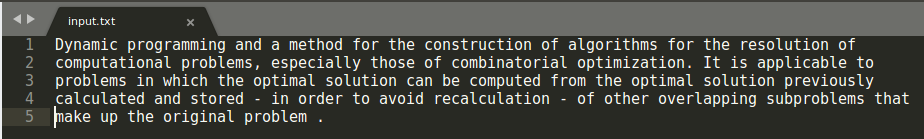
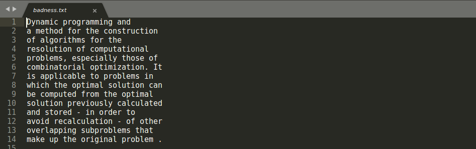
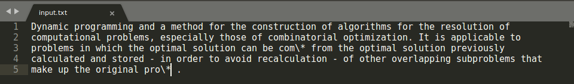
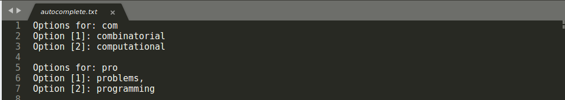
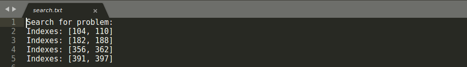

# Text Editor (C++):
## Team:
* Pedro Javier Paneca Cordova
* Davi Jose de Melo Silva
* Gustavo Augusto Calazans Lopes

**Note:** There will be no graphic interface.

## How to run the program:
1. Clone the repository;
2. Open the project folder;

### Linux:
1. Open the terminal;
2. Command to compile:
```
make compile_text_editor
```
3. Command to execute:
```
./text
```

### Windows:
1. Open the cmd;
2. Command to compile:
```
g++ -std=c++17 utilities/header.h searchAlgorithm/search.h searchAlgorithm/search.cpp autocompleteAlgorithm/autocomplete.h autocompleteAlgorithm/autocomplete.cpp badnessAlgorithm/badness.h badnessAlgorithm/badness.cpp textEditor.cpp -o text
```
3. Command to execute:
```
text
```

### Badness:
* Enter the text in the file **input.txt** that is in the **input folder**



* Run the program;
* Choose option 3;
* Enter the width of the indentation of the text;
* See the output in the file **badness.txt** that is in the **output** folder



#### Explain and Complexity:
For justified text, the idea is to have balanced lines, that is, to minimize
the total costs to balance the spaces, using the idea of dynamic programming
we fill in a matrix[i][j] where we first calculate the costs of putting words
from i to j per line. If the sequence of words from i to j does not fit on the line, the index
of the matrix[i][j] is considered to be infinite to not include in the solution. With the matrix
created, we use dynamic programming where we will assemble our solution verifying that the
cost of adding a word and the cost of having added the previous word is the best
solution, if it is included in the solution. With dynamic programming, we
recalculate already calculated subproblems. With this we obtain a complexity of O (n²) for
we calculate the costs of the matrix and O (n) to assemble the cost vector using dynamic programming.

### Autocomplete:
* Enter the text in the file **input.txt** that is in the **input folder**




* In the words you want to autocomplete, type **\\*** at the end of the word
* Run the program;
* Choose option 2;
* See the output in the file **autocomplete.txt** that is in the **output** folder



#### Explain and Complexity:
The algorithm used is a Trie of suffixes, where the idea is to create a tree
with all the words present in the text, where a prefix can be a
possible prefix of another word, so if we construct a Trie,
we can find a pattern of prefixes and add a word when
we do not have its suffix. With this we get a complexity of O (n)
where n is the size of the text to create the tree. To search for a prefix
in this tree we have a complexity of O (m) where m is the prefix of the word in
you want to search.

### Search:
* Enter the text in the file **input.txt** that is in the **input folder**


* Run the program;
* Choose option 1;
* Enter the word you want to search;
* See the output in the file **search.txt** that is in the **output** folder



#### Explain and Complexity:
The algorithm used is a Trie of suffixes, where the idea is to 
create a tree with all suffixes of the text, where a prefix can 
be a possible suffix of another word, so if we construct a Trie
suffixes, we can find a pattern. With this we achieved a complexity
of O (n) where n is the size of the text to create the tree. In each
node of the tree we save in what position the substring appeared.
To do the search we obtain a complexity of O (m + k) where m is the
size of the substring or string and k its quantity of occurrences.
