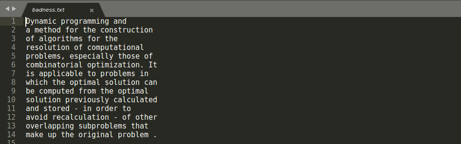
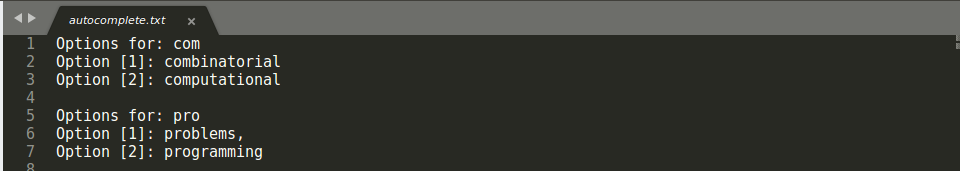

# Text Editor (C++):
**Note:** There will be no graphic interface.

## How to run the program:

### Linux:
1. Open the terminal;
2. Command to compile:
```
make compile_text_editor
```
3. Command to execute:
```
./text
```

### Windows:
1. Open the cmd;
2. Command to compile:
```
g++ -std=c++17 utilities/header.h searchAlgorithm/search.h searchAlgorithm/search.cpp autocompleteAlgorithm/autocomplete.h autocompleteAlgorithm/autocomplete.cpp badnessAlgorithm/badness.h badnessAlgorithm/badness.cpp textEditor.cpp -o text
```
3. Command to execute:
```
text
```

### Badness:
* Enter the text in the file **input.txt** that is in the **input folder**


* Run the program;
* Choose option 3;
* Enter the width of the indentation of the text;
* See the output in the file **badness.txt** that is in the **output** folder



#### Complexity: (GUSTAVO)
(explicar complexidade, algoritmo usado e como funciona)

### Autocomplete:
* Enter the text in the file **input.txt** that is in the **input folder**


* In the words you want to autocomplete, type **\\*** at the end of the word
* Run the program;
* Choose option 2;
* See the output in the file **autocomplete.txt** that is in the **output** folder



#### Complexity: (GUSTAVO)
(explicar complexidade, algoritmo usado e como funciona)

### Search:
* Enter the text in the file **input.txt** that is in the **input folder**


* Run the program;
* Choose option 1;
* Enter the word you want to search;
* See the output in the file **search.txt** that is in the **output** folder


#### Complexity: (GUSTAVO)
(explicar complexidade, algoritmo usado e como funciona)